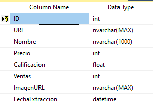

# Scraper de Componentes de PC en MercadoLibre

[](https://python.org)  

Scraper multihilo en Python que extrae datos de MercadoLibre Argentina, limpia los datos de producto, y los almacena en SQL Server o en formato CSV.

---

# 📋 Índice

1. [Características](#-características)  
2. [Requisitos](#-requisitos)  
3. [Instalación](#-instalación)  
4. [Configuración](#-Configuración)  
5. [Uso](#-Uso)  
6. [Esquema de la Base de Datos](#-Esquema-de-la-base-de-datos)  
8. [Resultados y Ejemplos](#-Resultados-y-ejemplos)  
---

# ✨ Características

- **Scraping multihilo** con número de hilos configurables
- Rapida ejecucion gracias a la implementación de multihilos y concurrencia al realizar las peticiones.
- User-Agents aleatorios y delays entre requests 
- Manejo automático de paginación  
- Limpieza de URLs para eliminar parámetros de tracking  
- Exportación a CSV e inserción masiva en SQL Server  
- Eliminación de duplicados y estadísticas de extracción  

---

# 🔧 Requisitos

- Python 3.8 o superior  
- Windows/macOS/Linux  
- SQL Server (con ODBC Driver 17) si se usan inserciones en DB  

---

# 🚀 Instalación

1. **Clonar con git la carpeta Notebook con el script y los requirements**  
   ```bash
   git init
   git remote add origin https://github.com/Mateo-Ponce/Mercado_Libre_scraper.git
   git config core.sparseCheckout true
   echo "Notebook/" >> .git/info/sparse-checkout
   git pull origin main

Otra alternativa es descargar los archivos manualmente.

# Configuración
### Instalar dependencias (Librerias)
*pip install -r requirements.txt*

### configuración SQL SERVER

Introducir los parametros de conección a tu base de datos SQL SERVER.
Si la tabla ProductosMercadoLibre no existe en tu base de datos, el script la creara automaticamente si los parametros de coneccion son correctos.
Para cambiar de motor de base de datos deberas cambiar las partes del script relacionadas con SQL SERVER.


# ▶️ Uso 
Ir a la pagina realiar una busqueda de un producto y copiar el url de esa busqueda.
El codigo esta en formato Jupiter Notebook, deben ejecutarse las celdas de codigo en orden.
al ejecutar el scraper te pedira:


-la página que quieres scrapear, copiar el URL de la busqueda de un producto

-Número de páginas a scrapear (por defecto: 5)

-Cantidad de hilos (por defecto: 4)

-Si quieres exportar a CSV

Luego de extraer, los datos se:

Desduplican

Exportan a productos_mercadolibre.csv (si elegiste esa opción)

Insertan en la tabla ProductosMercadoLibre de SQL Server


# 🗄️Esquema de la Base de Datos



# 📊*Resultados y Ejemplos*

### Datos normalizados e insertado en SQL server Ejemplo


### Ejemplo de Dashboard simple en Power Bi para la visualización de los datos
Los datos estructurados esta listo para integrarse a herramientas de business intelligence por ejemplo Power Bi:
El Dashboard esta basadao en la busqueda "componentes para pc" pero podria ser cualquier otra busqueda seleccionada por el usuario

