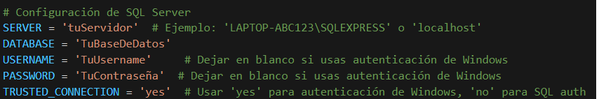
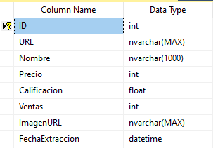
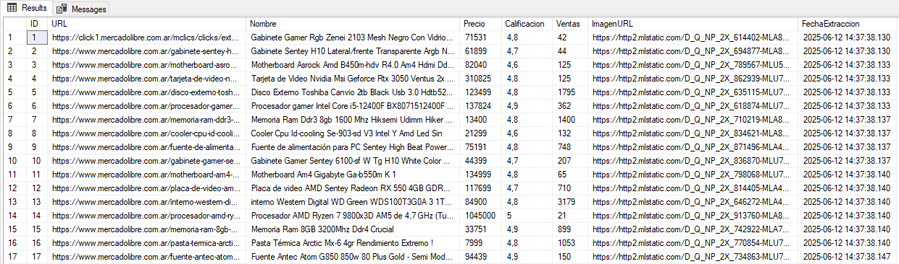
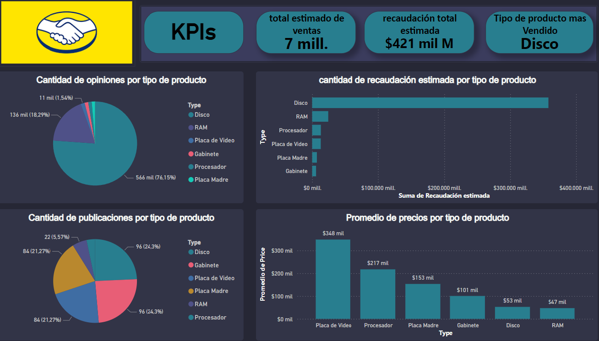

# Scraper de Componentes de PC en MercadoLibre

[](https://python.org)  

Un scraper multihilo en Python que extrae listados de componentes de PC de MercadoLibre Argentina, limpia y categoriza los datos de producto, y los almacena en SQL Server o CSV.

---

# 📋 Índice

1. [Características](#-características)  
2. [Requisitos](#-requisitos)  
3. [Instalación](#-instalación)  
4. [Configuración](#-configuración)  
5. [Uso](#-uso)  
6. [Esquema de la Base de Datos](#-esquema-de-la-base-de-datos)  
8. [Resultados y Ejemplos](#-resultados-y-ejemplos)  
---

# ✨ Características

- **Scraping multihilo** con número de hilos configurables  
- User-Agents aleatorios y delays entre requests 
- Manejo automático de paginación  
- Limpieza de URLs para eliminar parámetros de tracking  
- Exportación a CSV e inserción masiva en SQL Server  
- Eliminación de duplicados y estadísticas de extracción  

---

# 🔧 Requisitos

- Python 3.8 o superior  
- Windows/macOS/Linux  
- SQL Server (con ODBC Driver 17) si se usan inserciones en DB  

---

# 🚀 Instalación

1. **Clonar el repositorio**  
   ```bash
   git clone https://github.com/tu-usuario/mercadolibre-pc-scraper.git
   cd mercadolibre-pc-scraper
   https://github.com/Mateo-Ponce/Mercado_Libre.git

# Configuración
### Instalar dependencias
*pip install -r requirements.txt*

### configuración SQL SERVER

si bien hardcodear los parametros de la base de datos no es una buena practica en scripts en producción al ser este solo un proyecto deicidí hacerlo de esta manera



# ▶️ Uso 
El codigo esta en formato Jupiter Nootebook, deben ejecutarse las celdas de codigo en orden.
al ejecutar el scraper te pedira:


-la página que quieres scrapear, busca en mercado libre un producto y copia el URL de esa busqueda

-Número de páginas a scrapear (por defecto: 5)

-Cantidad de hilos (por defecto: 4)

-Si quieres exportar a CSV

Luego de extraer, los datos se:

Desduplican

Exportan a productos_mercadolibre.csv (si elegiste esa opción)

Insertan en la tabla ProductosMercadoLibre de SQL Server


# 🗄️Esquema de la Base de Datos



# 📊*Resultados y Ejemplos*

### Datos normalizados e insertado en SQL server Ejemplo



### Ejemplo de Dashboard simple en Power Bi para la visualización de los datos
El Dashboard esta basadao en la busqueda "componentes para pc" pero podria ser cualquier otra busqueda seleccionada por el usuario

