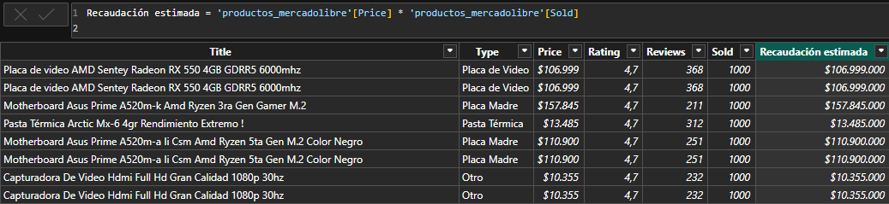

# **Mercado libre ETL web Scraping y Analisis**

<h1>Indice</h1>

    <ul>
        <li>
            <a href="#Codigo-Python">Código Python</a>
            <ul>
                <li><a href="#Funciones">Funciones</a></li>
                <li><a href="#Main">Main</a></li>
            </ul>
        </li>
        <li>
            <a href="#Dataset">Dataset</a>
        </li>
        <li>
            <a href="#Power-BI">Power BI</a>
            <ul>
                <li><a href="#DAX">DAX</a></li>
                <li><a href="#Dashboard">Dashboard</a></li>
            </ul>
        </li>
        <li>
            <a href="#Conclusiones">Conclusiones</a>
        </li>
    </ul>

# **Introducción**
Este proyecto tiene como objetivo automatizar la extracción, transformación y carga (ETL) de datos desde Mercado Libre mediante web scraping. Utilizamos Python como herramienta principal, junto con las librerías BeautifulSoup, requests y pandas, para recopilar, limpiar y transformar datos no estructurados en datos estructurados.

Los datos procesados se guardan en un archivo CSV quedando listos para integrarse con otras herramientas, a modo de ejemplo vamos a usar power bi para explorar los datos, construir visualizaciones que faciliten la interpretación de los resultados y generar valiosos insights.

# **Codigo Python**

A modo de ejemplo vamos a trabajar con la categoria "componentes de pc", pero podria ser cualquier categoria de productos en mercado libre simplemente cambiado el link.

## Funciones:
- #### *get_product_links*: su primer parametro es el link de la sección  a scrapear y el segundo la cantidad de paginas, asi se puede elegir que sección  recopilar datos y la cantidad de paginas. La funcion retorno una lista con los links de todos los productos producto en el rango.

  

  
- #### *extract_product_data*: recibe un link de una publicacion de un producto como parametro, utilizando request y BeautifulSoup guarda el html del la pagina, crea un diccionario scrapeando por ejemplo el titulo, el precio, el tipo de producto, etc. Esta funcion extrae y hace pequeñas transformaciones para adaptar los datos en un buen formato, finalmente devuelve un diccionario con las claves y los valores del producto.

- #### *classify_product_type*: funcion complentaria que nos ayuda a llenar la columna "type" recorre los titulos de los producto buscando palabras claves como "procesador", "gabinete", "ram" si encuentra coincidencia el producto se guarda en esa categoria.

## **MAIN**

inicializa una lista vacía llamada all_products, esta lista almacena cada diccionario de cada producto, al finalizar el bucle se convierte el diccionario en un DataFrame de pandas, para luego guardarlo como csv.
en este ejemplo de Scrapearon 10 paginas y se creo un dataSet con 477 filas que representan cada producto, de esta manera de registra de forma estructurada la informacion de cada producto de forma automatica y queda
lista para utilizarse en distintas herramientas, como excel, sql, power Bi, etc.

# **dataset**

# **Power bi**

## **DAX**
utilizamos una formula DAX para crear una nueva columna que almacena la recaudación estimada por cada producto.

## **Dashboard**

# **conclusiones**
